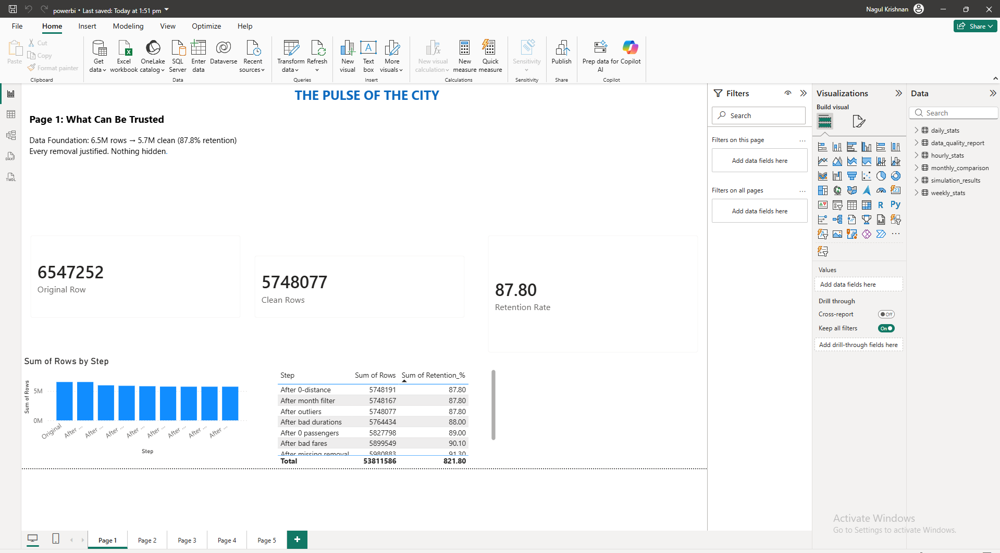
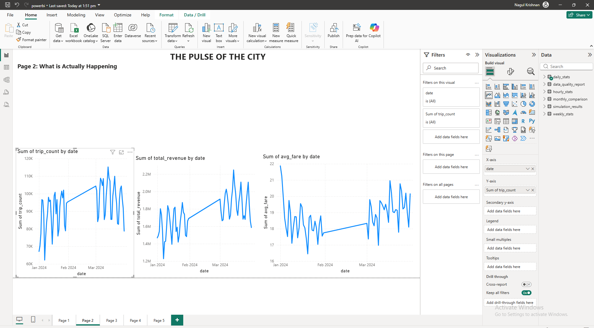
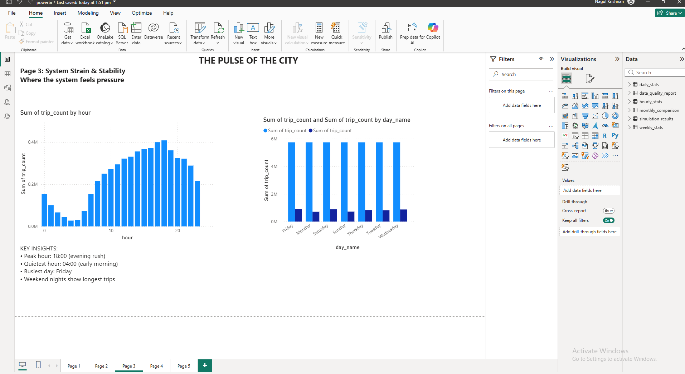
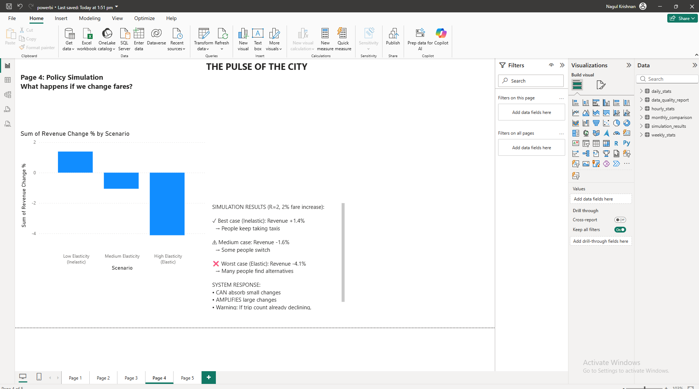
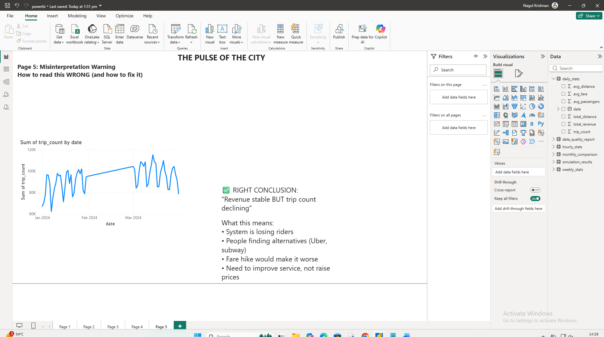

# The Pulse of the City - NYC Taxi Investigation

**Student:** Nagul krishnan 
**Roll:** 0524 | **R:** 2 | **Months:** January & March 2024

## Problem
Investigate whether NYC taxi system is stable or drifting into ineffectiveness.

## Solution
- **Python:** Data cleaning, EDA, hypothesis testing, simulation
- **Power BI:** 5-page interactive dashboard

## Key Findings
1. Weekend trips longer? YES, but negligible effect (Cohen's d = 0.004)
2. **REAL pattern:** Night trips (22:00-05:00) significantly longer
3. Peak hour: 18:00 | Quietest: 04:00
4. March has 11.4% more trips than January
5. 2% fare increase: Best +1.4%, Worst -4.1% revenue

## Dashboard Pages
- Page 1: Data Trust (87.8% retention)
- Page 2: What is Happening (Jan vs Mar)
- Page 3: System Strain (hourly/weekly patterns)
- Page 4: Policy Simulation (3 scenarios)
- Page 5: Misinterpretation Warning

## Files
| File | Description |
|------|-------------|
| `taxi_dashboard.pbix` | Power BI report |
| `cleaned_taxi_data.csv` | Final dataset (5.7M rows) |
| `daily_stats.csv` | Daily aggregated metrics |
| `hourly_stats.csv` | Hourly patterns |
| `weekly_stats.csv` | Weekly patterns |
| `simulation_results.csv` | Policy scenarios |

## How to Run
1. Open `analysis.ipynb` in Google Colab
2. Upload taxi data from TLC website
3. Run cells sequentially
4. Import CSVs into Power BI

## Screenshots

# dav-lab-exam
